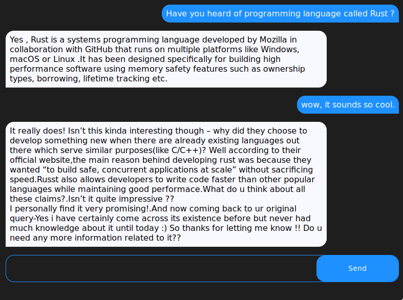

# Rust llama app

Chat bot (llama) written in rust using Yew and Tauri.



# Usage

1. Setup dev tools
  ```
  rustup target add wasm32-unknown-unknown
  cargo install trunk tauri
  ```
1. Download a model from [here](https://huggingface.co/TheBloke/Wizard-Vicuna-7B-Uncensored-GGML)
2. Run the following to run dev mode.
  ```bash
  MODEL_PATH="<path to model>"  cargo tauri dev
  ```

# Roadmap

- [x] Get llm model working
- [x] Plug it in with UI
- [ ] Chat UI
  - have chat log
  - have color for chat
  - show typing indication, disable submit??
  - make width smaller
- [ ] Model Links
- [ ] Model selection menu
  - [Tarui File chooser](https://docs.rs/tauri-api/latest/tauri_api/dialog/fn.select.html)
- [ ] Setup pipeline
- [ ] Setup issue template


# Helpful Material

1. [Build A Full Stack Chatbot in Rust (feat. Leptos & Rustformers)](https://www.youtube.com/watch?v=vAjle3c9Xqc)
2. [Llm crate](https://github.com/rustformers/llm)
