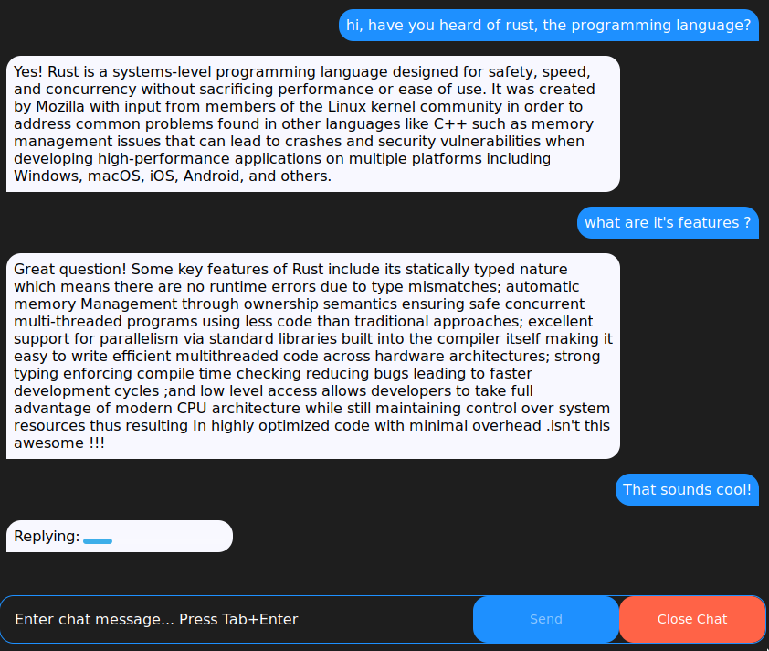

# Rust llama app

Chat bot (llama) written in rust using Yew and Tauri.



# Usage

1. Setup dev tools
  ```
  rustup target add wasm32-unknown-unknown
  cargo install trunk tauri
  ```
1. Download a model from [here](https://huggingface.co/TheBloke/Wizard-Vicuna-7B-Uncensored-GGML)
2. Run the following to run dev mode.
  ```bash
  cargo tauri dev
  ```
3. Select the model you downloaded.

# Roadmap

- [ ] Chat UI
  - have chat log
  - when chat submitted
    - show typing indication
    - disable father submit
- [ ] Setup pipeline
- [ ] Setup issue template


# Helpful Material

1. [Build A Full Stack Chatbot in Rust (feat. Leptos & Rustformers)](https://www.youtube.com/watch?v=vAjle3c9Xqc)
2. [Llm crate](https://github.com/rustformers/llm)
